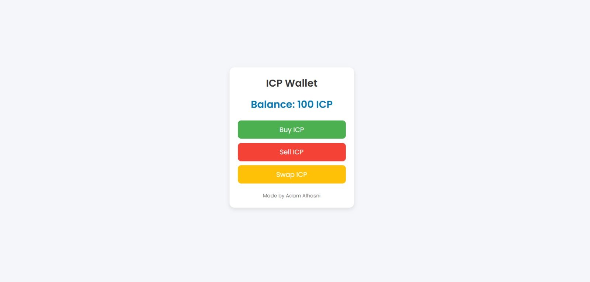

# Static website

[View this sample's code on GitHub](https://github.com/RoboticScandal/IPC-Wallet.git)

## Overview
The example shows how to deploy a simple wallet, this is the output example:



The purpose of this example is to show how to deploy a static website in an asset canister. While the website in this example is very simple, the method would be the same for a more advanced static website, e.g. based on popular static site generators.

This example covers:

- Build a very simple HTML website
- Create the dfx.json file
- Deploy the canister smart contract locally
- Test the frontend in browser 

### Install
Install the example dapp project:

```bash
git clone https://github.com/RoboticScandal/IPC-Wallet
cd ICP_test
```

## Documentation
There are two parts in this dapp. One is the website and the other is `dfx.json`. Since there's no backend, there is not any benefit of using the `dfx new project_name` command to set up a template. The `dfx.json` file is all that is needed.

### dfx.json
The `dfx.json` file is a configuration file which specifies the canister used for the dapp. In this case only one canister is needed, and besides the canister configuration, `dfx.json` also includes information about DFX version, build settings and network settings.

```json
{
    "canisters": {
        "www": {
            "frontend": {
                "entrypoint": "assets/src/index.html"
            },
            "source": [
                "assets/assets",
                "assets/src"
            ],
            "type": "assets"
        }
    },
    "defaults": {
        "build": {
            "args": "",
            "packtool": ""
        }
    },
    "networks": {
        "local": {
            "bind": "127.0.0.1:8000",
            "type": "ephemeral"
        }
    },
    "version": 1
}
```

This is all needed for creating a canister smart contract for hosting a static website on the IC.

## Deployment
The local replica is started by running:

```bash
dfx start --background
```

When the local replica is up and running, run this command to deploy the canisters:

```bash
dfx deploy
```

## License
This project is licensed under the Apache 2.0 license, see `LICENSE.md` for details. See `CONTRIBUTE.md` for details about how to contribute to this project. 
